> 写在前面的话
>
> 本阶段的重点为JavaScript这门语言的各种语法，需要重点掌握的是每种语法的写法，用途，而不是用来熟练语法的题目。因为JavaScript这门语法是一门编程语言，需要一定的逻辑思维，所以设置这些题目的意义在于：一来可以熟练大家的语法，二来锻炼大家的逻辑思维。但是思维不是一朝一夕可以形成的，切不可急躁，应该先把简单和语法记熟，再尽量掌握解决题目的方法

# JavaScript介绍

## 教学目标

- [ ] 能认识到JavaScript是一门编程语言
- [ ] 能说出JavaScript的三个组成部分  

## 为什么要学习JavaScript

我们在之前已经学习了HTML和CSS这两个技术，这两个技术能做的是页面的静态效果，如果想让页面上有一些能动起来的效果，比如轮播图、数据格式验证等，就要用到JavaScript。简而言之：

* HTML - 页面的骨架
* CSS - 页面的外貌
* Javascript - 页面的行为能力

## 什么是JavaScript

> Javascript是一门运行在**浏览器**上的**脚本语言**
>

JavaScript就是一门让我们和浏览器交流沟通的语言，我们在写这门语言的时候，要遵循这门语言的固定语法，使用其特定单词，浏览器才能读懂。浏览器不像人，浏览器是认死理的，不会灵活理解我们所写的代码，所以一定要严格按照JavaScript的语法来写代码

那么什么是语法：语法就是我们表达时必须遵守的固定格式。

例如：

正常的说法：小明吃了一只鸭子

如果我们不按照固定的格式说，可能变成：鸭子吃了一只小明

这是一件非常恐怖的事！！！

所以——遵循语法非常重要

综上所述，我们要学习的，就是JavaScript这门语言的**语法**和里面特有的**单词**

JavaScript简称`js`

## JavaScript的组成

* ECMAScript - 简称es，用来规范JavaScript的语法的，具有多个版本。
* DOM - 文档对象模型，用来操作页面上的标签的
* BOM - 浏览器对象模型，用来操作浏览器的部分功能的

# 第一个JavaScript程序

## 教学目标

- [ ] 能在script标签中书写代码
- [ ] 能使用script标签引入js文件

## JavaScript该写在哪里

JavaScript和css一样，也有三种书写方式

* 外链式
* 内嵌式
* 行内式

### 外链式

1. 首先我们要新建一个以`.js`结尾的文件

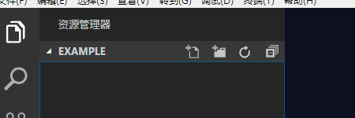

2. 在新建的js文件里面输入以下代码

```javascript
alert('helloworld');
```

3. 新建一个html文件

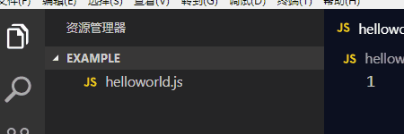

4. 在html文件里面使用`script`标签引入刚才写好的js文件

```html
<script src="helloworld.js"></script>
```

5. 在浏览器中运行html文件，即可看到效果

> 注意点：外链式使用的script标签里面不能再像内嵌式那样写书代码，这样是无效的

### 内嵌式

1. 在页面的底部写书一个script标签

```html
</body> 
</html>
<script></script>
```

2. 在script标签里面输入代码

```html
<script>
	alert('helloworld');
</script>
```

3. 在浏览器中运行html文件即可看到效果

### 行内式(了解，一般不用)

```html
<input type="button" value="点我" onclick="alert('helloworld')">
```

只要点击按钮，就会执行js代码

>  总结
>
> 1. 一般在开发中使用外链式比较多
> 2. 我们讲课和练习代码的时候使用内嵌式比较多


> 回顾
>
> 1.JavaScript是一门编程语言，运行在浏览器里面。
>
> 2.学习语言，就是学习语言的单词和语法
>
> 3.JavaScript的书写位置有三种但是常用的只有两种：内嵌式和外链式，其中外链式中的script标签里面不能写代码

# 注释语法

## 教学目标

- [ ] 能写出js中的注释

其实学习任何一门语言之前，最应该先学习的语法就是注释语法，这样我们就可以在代码中写一些说明和笔记之类的

JavaScript里面的注释有两种

## 单行注释

就是两个斜线，在斜线后面的内容是不会被浏览器识别的

```javascript
// 在这里写你要注释的内容
```

## 多行注释

```javascript
/*
	在这写你要注释的内容
*/
```


> 回顾
>
> 1.JavaScript和html、css不一样，有两个注释语法
>
> 2.单选注释用于写少量注释，多行注释用于写大量注释

# JavaScript在浏览器中提供的输入输出的方法

## 教学目标
- [ ] 能使用alert()在页面中弹出一个提示框
- [ ] 能使用console.log() 在控制台中输出内容

刚才的程序中，我们使用了`alert`方法输出了一个消息，其实在JavaScript中，不仅仅只有这么一个可以输出的方法，下面我们一起来学习一下几个常用的输入输出方法

## alert()

作用：这个方法用于在浏览器上弹出一个提示框


使用方法：

```javascript
alert("提示消息"); // 在小括号里面写一个你要输出的消息，如果不是数字，请使用双引号包起来
alert('提示消息'); // 或者使用单引号包起来也行
```


## console.log()

作用：这个方法可以在开发者工具的 `Console`选项，也就是我们所说的`控制台`里面输出消息

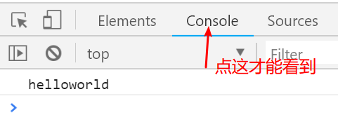

使用方法：

```javascript
console.log("helloworld"); // 如果消息不是数字，还是使用引号包起来
```

## document.write()

作用：这是一个比较早期的时候，浏览器里面提供的一个在页面的body标签里面输出消息的方式，现在很少用了

代码：

```javascript
document.write('helloworld');
```

效果：


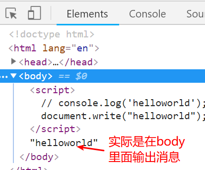


## prompt()

作用：在浏览器里面弹出一个输入框，让用户输入


用法：

```javascript
prompt("请输入你的银行卡密码"); // 同样使用引号包起来
```


> 回顾
>
> 1.提示用户某些信息使用alert()
>
> 2.让用户输入数据可以使用prompt()
>
> 3.自己调试代码的时候多用console.log()

# 变量

## 教学目标
- [ ] 能使用var定义变量
- [ ] 能理解变量在内存中的存储
- [ ] 能交换两个变量的值

如果我们使用prompt()方法让用户输入了数据，我们又想要把用户输入的数据保存起来，怎么办呢？

在JavaScript中有一种专门用于保存数据的语法：**变量**

## 什么是变量

变量就是存储数据的容器

## 变量的语法

用是先定义再使用

### 变量定义

```javascript
var 变量名 = 数据;
```

使用`var`这个单词，告诉浏览器，我们要定义一个变量，使用`=`号告诉浏览器，我们要把左边的数据存储到变量里面

当我们想使用这个数据的时候，就可以直接使用这个变量代替这个实际数据

```javascript
// example 1
var pwd = prompt('请输入你的很行卡密码');
console.log(pwd);
// example 2
var num1 = 10;
var num2 = 20;
console.log(num1 + num2);//计算两个数字的和
```

变量定义分为两个过程：变量声明和变量赋值

```javascript
// 变量声明
var a;
// 变量赋值
a = 10;
```

变量可以被重新赋值

```javascript
var b = 100;
b = 200;
```

上面代码中，`200`被称为变量`b`的`值` 

## 变量是如何存储数据的

我们说变量是存储数据的容器，但是变量是如何对数据进行存储的呢？

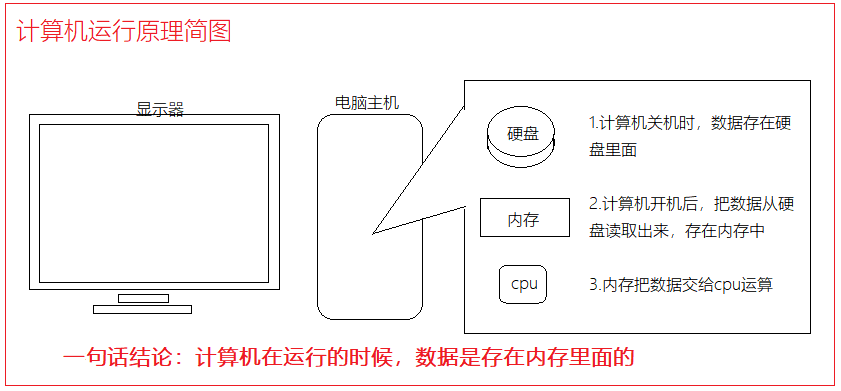

那么变量又是怎么跟数据扯上关系的？


## 变量命名规范

变量的名字是我们自己给它取的，取名字都是有要求的，不是乱取的，变量的名字是有一个规定的

1. 变量名字只能使用：字母、数字、下划线、$符号

2. 变量名字不能用数字作为开头(不要总想搞点大新闻，正常用字母开头就行)
3. 变量名字不能使用JavaScript语法中的关键字和保留字
4. 变量名字是区分大小写的

使用代码证明

```javascript
// 变量不能使用数字开头
var 15a = 10;
// 会在控制台中报错：Uncaught SyntaxError: Unexpected number
// Uncaught - 未捕获的
// SyntaxError - 语法错误
// Unexpected - 意料之外的
// number - 数字
// 翻译过来就是： 这行有一个语法错误，你的数字不符合语法要求
```

> Tips :
>
> 大家在学习的过程中，会遇到许多错误，要习惯看控制台中的错误代码，也可以自己准备一个错题集，把常见的错误记录下来，以便以后遇到同样的错误的时候可以借鉴以前解决错误的思路

### 关键字

关键字是在JavaScript语法中，具有特殊意义的单词，比如我们学习过的用于声明变量的`var` 

```javascript
// 变量名字不能使用关键字
var var = 20;
// 会在控制台中报错： Uncaught SyntaxError: Unexpected token var
// token - 标记，记号，在编程中我们翻译成 '标识符'
// 意思是这行有一个语法错误，出现了一个意料之外的标识符 var
```

### 保留字

JavaScript是不断发展的，以前的功能用了以前的关键字，将来要加入新的功能的时候，可能要用到新的关键字，所有JavaScript在一开始的时候就保留了部分单词，以便将来把保留的单词作为关键字


```javascript
// 变量名字是区分大小写的
var a = 10;
console.log(a);// 正常输出
console.log(A);// 在控制台中报错：Uncaught ReferenceError: A is not defined
// ReferenceError - 引用错误
// not defined - 未定义
// 意思是 A 这个变量我们没有定义就使用了，可见a和A是不一样的，不是同一个变量
```


## 变量其它语法补充

```javascript
// 变量可以一次声明多个
var a = 10, b = 20 , c;
console.log(a,b,c);
```

```javascript
// 变量也可以不使用var声明，但是这个方式不推荐使用(后面课程解释)
a = 10;
console.log(a);
```

```javascript
// 字面量概念的补充
var a = 10;
// a 我们称为变量，10这种不会变量的，我们可以直接使用的，称为 字面量
```

## 练习

```javascript
// 交换两个变量的值
var a = 10; 
var b = 20;
// 最终效果是让a的值是20，b的值是10
// 1. 准备第三个变量，先存储a的值
var temp = a;
// 2. 让a存储b的值
a = b;
// 3. 让b存储temp的值(a原来的值)
b = temp;
// 验证
console.log(a,b); // 此时a是20，b是10
```


> 回顾
>
> 1.数据存储在内存中，不容易管理，使用一个别名——变量代表，会容易使用很多
>
> 2.定义一个变量的做法：var 变量名 = 数据
>
> 3.变量的命名尽量不要使用不明确的单词，方便阅读

# 数据类型

## 教学目标
- [ ] 能说出5种数据类型

> 思考 : 

```javascript
// 两个变量：
var a = 123;
var b = '123';
```

都是可以的，这两个数据有什么不同？——它们的数据类型不同。举个例子：中国的人的名字，是由几个中文组成的，人的体重，是数字，不同的数据可以由不同的类型来描述。

## 基本类型

在js中，基本类型可以分为以个几个大类：

### 数字(number)类型

所有的数字都是数字类型，如：10，99.8，-12...

但是在js这门语言里面，有一个特殊的东西——`NaN`，这个东西也是数字类型，用来表示某个结果不是一个数字

### 字符串(string)类型

把多个字符组成一串，就是一个字符串。

在js中，字符串的表示方式有一个固定格式：js中的字符串使用引号包起来，双引号和单引号都可以

```javascript
// 如：
var a = 'abc';
var b = "def";
```

也就是说，我们要使用字符串，就要使用引号包起来

#### 转义字符

我们发现，在js的语法中，已经使用了引号来做为格式了，如果我们就是要输出一个引号，不使用特殊的手段是做不到的

比如说我们要输出一段课文：小明说:"小红明天真漂亮"  

```javascript
console.log("小明说:"小红明天真漂亮"");
```

此时会在控制台中报错： Uncaught SyntaxError: missing ) after argument list

因为此时第一个引号和第二个引号组成一对，第三个和第四个组成一对，中间的中文就无法解析。所以我们要把第二个和第三个引号变成没有特殊作用的引号，可以使用转义字符来完成。

```javascript
console.log("小明说:\"小红明天真漂亮\"");
```

所谓转义字符，就是在想要转义的字符前面加上一 `\`，这样就把带有特殊意思的字符变成了普通的字符，就可以输出了


### 布尔(boolean)类型

布尔类型是一种专门为了编程设置的一种语法，主要用来表示一个结果的成立与否，其值只有两个

true - 表示结果成立，为真

false - 表示结果不成立，为假

```javascript
var result = 4 > 5;
console.log(result);// false ,因为 4 > 5 不成立
var res = 5 < 6;
console.log(res); // true 因为 5 < 6 成立
```

### null

只有一个值，null，表示数据为空

```javascript
var a = null;// 表示这个数据为空
```

### undefined

只有一个值，undefined，表示变量定义了，没有定义

```javascript
var a;
console.log(a);// 输出undefined
```

## 复杂类型

就是Object类型，我们后面才学习。


## typeof

我们学习了这么多的数据类型，怎么知道一个数据到底是什么类型呢？js提供了一个可以返回数据类型的关键字：typeof

用法有两种

```javascript
typeof 数据;
typeof(数据);
```

```javascript
console.log(typeof 123);// number
console.log(typeof 'abc');//string
console.log(typeof true); // true
console.log(typeof undefined); // undefined
```


> 回顾
>
> 1.数据是分类型的，JavaScript里面有两种大类型：简单(值)和复杂(引用)
>
> 2.简单类型分为：数字、字符串、布尔、null、undefined
>
> 3.可以使用typeof获取数据的类型

# 数据类型转换

## 教学目标
- [ ] 能使用Number()/parseInt()/parseFloat()将其它类型转换成数字
- [ ] 能使用String()/toString()将其它类型转换成字符串
- [ ] 能说出JavaScript中转换成布尔类型结果是false的6个情况

我们学习了那多的知识，现在可以做一个程序：

1 让老板输入员工的绩效工资

2 计算总工资(总工资 = 基础工资 + 绩效工资)

3 使用alert() 展示总工资

```javascript
// 让老板输入绩效工资
var performance = prompt('请输入张三的绩效工资');
var base = 4000;
// 计算总工资
var salary = base + perfomance;
// 展示总工资
alert(salry);
```

如果我们输入的绩效工资是：3000

alert()展示的工资将是：40003000

这是不符合事实的！！！原因是我们输入的3000是一个字符串，字符串加上数据得出一个不正确的结果。所以我们要把字符串的3000变成数字的3000 —— 数据类型转换

## 其它类型转换成数字

### Number()

Number这个方法可以将其它的类型数据转换成数字，用法就是把数据放到括号里面

```javascript
var res1 = Number('123');
console.log(res1); // 输出数字123
console.log(typeof res1); // 输出 number

var res2 = Number(true);
console.log(res2);// 输出 1
console.log(typeof res2); // 输出number

var res3 = Number(null);
console.log(res3); // 输出0
console.log(typeof res3); // 输出number

var res4 = Number(undefined);
console.log(res4); // 输出 NaN  , NaN 就是 not a  number 的缩写，表示某个结果不是一个数字
console.log(typeof res4); // 输出 number
```

### parseInt()

parseInt这个方法用于将字符串转换成整数

```javascript
var res1 = parseInt('123');
console.log(res1); // 输出 123 
console.log(typeof res1); // 输出number

var res2 = parseInt('12a');
console.log(res2);// 输出 12
console.log(typeof res2);// 输出number

var res3 =parseInt('a123');
console.log(res3); // 输出 NaN
console.log(typeof res3); // 输出number
```

parseInt的转换规则是，从字符串的左边开始，一个一个字符的转换，直到转换到第一个不是数字的字符为止

### parseFloat()

parseFloat这个方法用于转换字符串转换成小数(在编程中，小数也称浮点数)

```javascript
var res1 = parseInt('123.123');
console.log(res1); // 输出 123.123
console.log(typeof res1); // 输出number

var res2 = parseInt('12.12a');
console.log(res2);// 输出 12.12
console.log(typeof res2);// 输出number

var res3 =parseInt('a12.3');
console.log(res3); // 输出 NaN
console.log(typeof res3); // 输出number
```

parseFloat的转换规则和parseInt的规则是一样的

## 其它类型转换成字符串

### String()

String方法用于将其它类型转换成字符串类型

```javascript
var res1 = String(123);
console.log(res1);  // 输出字符串的 123
console.log(typeof res1); // 输出 string

var res2 = String(true);
console.log(res2); // 输出字符串的 true
console.log(typeof res2); // 输出 string

var res3 = String(undefined);
console.log(res3); // 输出 字符串 undefined
console.log(typeof res3);// 输出 string

var res4 = String(null);
console.log(res4); // 输出 字符串null
console.log(typeof res4); // 输出 string
```


### .toString()

这个方法也可以把其它类型转换成字符串类型

```javascript
var res1 = (123).toString();
console.log(res1); // 输出字符串123
console.log(typeof res1); // 输出string

var res2 = true.toString();
console.log(res2); // 输出字符串true
console.log(typeof res2); // 输出string

var res3 = undefined.toString();
console.log(res3); // 报错：Cannot read property 'toString' of undefined

var res4 = null.toString();
console.log(res4); //报错： Cannot read property 'toString' of null
```

注意点： undefined和null不能使用这个方式变成字符串

## 其它类型转换成布尔

### Boolean()

Boolean这个方法用于将其它类型转换成布尔类型

```javascript
var res1 = Boolean(123);
console.log(res1);// 输出true
console.log(typeof res1); // 输出 boolean

var res2 = Boolean('abc');
console.log(res2);// 输出true
console.log(typeof res2); // 输出 boolean

var res3 = Boolean(undefined);
console.log(res3);// 输出false
console.log(typeof res3); // 输出 boolean

var res4 = Boolean(null);
console.log(res4);// 输出true
console.log(typeof res4); // 输出 boolean
```

在js里面，我们在转换其它类型为布尔类型的时候，只有6个情况是false

```javascript
var res1 = Boolean(0);
console.log(res1); //输出false
var res2 = Boolean('');
console.log(res2); //输出false
var res3 = Boolean(NaN);
console.log(res3); //输出false
var res4 = Boolean(undefined);
console.log(res4); //输出false
var res5 = Boolean(null);
console.log(res5); //输出false
var res6 = Boolean(false);
console.log(res6); //输出false
```


>  回顾
>
> 1.转换成数字： Number(),parseInt(),parseFloat()
>
> 2.转换成字符串：String(), .toString()
>
> 3.转换成布尔：Boolean()


# 操作符

## 教学目标
- [ ] 能使用++符号和--符号实现数字的自增和自减
- [ ] 能区分==和===的不同

操作也称运算符，就是在js中进行各自运算用的

## 算术操作符

js中，现阶段我们需要掌握的算术操作符有

```javascript
// +  -  *  /  %
// ++ --
```

`+ `操作符的作用有：

1. 数字相加
2. 字符串相连

```javascript
// 数字相加
var res1 = 1 + 1;
console.log(res1); // 输出2
var res2 = 10 + 20;
console.log(res2); // 输出30

// 字符串相连
var res3 = "abc"+"def";
console.log(res3);//输出 abcdef

```

但是我们使用字符串加数字也是可以的

```javascript
// 字符串 + 数字
var res4 = "abc" + 123;
console.log(res4);// 输出 abc123
```

结果是"abc123"的原因是：数字和字符串相加，里面有一个 `隐式转换` 过程

当一个字符串和数字相加的时候，数字会隐式转换为字符串，就是两个字符串相加，结果是两个字符串相连

`-`操作符的作用就是数字相减

```javascript
var res1 = 1 + 1;
console.log(res1);// 输出2
var res2 = 10 - 20;
console.log(res2); // 输出 -10
```

但是我们使用字符串和数字相减，有时候也是可以的

```javascript
var res3 = '456' - 123; 
console.log(res3); // 输出 数字 333
var res4 = 'abc' - 123;
console.log(res4); // 输出NaN
```

这是因为，数字和字符串在相减的过程中，会把字符串隐式转换成数字，再相减。但是如果字符串在转换的过程中，无法转换成数字，就会转换成`NaN`，再计算就无法得到一个正确的数字结果


`*`操作符的作用是两个数字相乘

`/`操作符的作用是两个数字相除

`%`操作符的作用是两个数字求模(得到余数)

这三个操作的隐式转换规则和`-`操作的规则是一样的，就不再重复了

演示一下`%`操作符的用法

```javascript
var res1 = 10 % 3;
console.log(res1);// 输出1 ，因为 10 = 3 x 3 ... 1 余数是1
var res2 = 5 % 3;
console.log(res2); // 输出2 ， 5 = 1 x 3 ... 2 余数是2
```


### 自增操作符、自减操作符

`++`自增操作符的作用是让一个数字在原来的基础上自增

```javascript
var a = 10;
a++;
console.log(a);// 输出11
// a++ 的过程相当于 a = a + 1
```

但是自增和自减操作符是可以写在数据前面和后面的

```javascript
var a = 10;
++a;
console.log(a); // 输出11
```

两者的区别在于运算顺序不同

**a++** : 参与运算的时候，会先用原来的值先运算，再自增

**++a**: 参与运算的时候，会先在原来的基础上自增，再使用新的值参与运算

```javascript
var a = 10;
var b = a++ + 10; // 运算的时候，使用a的原来值10参与加法运算，10+10赋值给b之后，再实现a的自增
console.log(b); // 输出20
console.log(a); // 输出 11

var c = 10;
var d = ++a + 10; // 运算的时候，先执行a的自增，再使用a自增后的值11和10相加，最终结果是 11 + 10
console.log(d); // 输出21
console.log(c); // 输出11
```

这个自增操作符会在我们后面学习`循环语法`的时候使用

`--`操作符的作用是让一个数据自减

```javascript
var a = 10;
a--;
console.log(a);// 输出9
// a-- 相当于 a = a - 1
```

自减操作也可以放在数据的前面和后面，运算规则和`++`是一样的

## 隐式转换

隐式转换是指在数据在参与运算的过程中，数据根据操作符的运算规则自动进行的数据类型转换。

## 比较操作符

比较操作符的就是比较两个数据，操作符号有

```javascript
>  <  >=  <=
```

这几个符号的作用和数字中学习的比较是一样的，就是比较两个数字的大小，运算结果是 布尔 类型

```javascript
console.log( 4 > 5); // 输出false
console.log( 4 < 5); // 输出 true
```

还有两类的操作符

```javascript
== 	 !=
===  !==
```

`==` 和 `===` 是用来比较两个数据是否相等的

```javascript
var res1 = '123' == 123;
var res2 = '123' === 123;
console.log(res1); // true
console.log(res2); // false
```

两者的区别在于

`==` 只会比较两个数据的值，不会比较数据的类型

`===` 不仅比较两个数据的值，还比较数据的类型

`!=` 和`!==` 是比较两个数据是否不相等的

```javascript
var res1 = '4' != 4;
var res2 = '4' !== 4;
console.log(res1); // 输出 false ,比较两个数据的值是否不相等, 此时两个数据的 值 都 4 ，相等，结果是 false
console.log(res2); // 输出 true ，比较两个数据的类型和值是否不相等，此时两个数据的类型不相等，结果是 true
```

区别：

`!=` 只比较值

`!==` 同时比较值和类型

> 为了程序的严谨，我们建议使用 `===` 和 `!==`

## 逻辑操作符

逻辑运算符的主要作用是连接多个条件，我们要掌握的比较运算符有

```javascript
&&  ||  ！
```

`&&` 用在需要多个条件同时成立的时候

```javascript
// 用户在登录的时候要用户名和密码同时正确才能登录
var userName = prompt('请输入用户名');
var password = prompt('请输出密码');
console.log(userName === 'admin' && password === '123456');
// 只有 && 两边的 结果都是 true ，最终结果才是 true
```

`||` 用在只需要任意条件成立的时候

```javascript
// 只要年龄小5岁或者身高小于120cm就可以免费乘坐
var age = parseInt(prompt('请输入你的年龄'));
var height = parseFloat(prompt('请输入你的身高'));
console.log(age < 5 || height < 120);
// 只要 || 两边的结果有一个是true，最终结果就是true
```

`!` 用于颠倒是非的时候

```javascript
var res = true;
console.log(!res);
// 这里暂时用不到，在后面做具体效果的时候都用，那个时候我们再学习具体的使用
```


## 赋值操作符

要掌握的赋值操作符有两个大类

```javascript
=
+=  -=  *=  /=  %=
```

`=` 的作用就是把右边的结果赋值(存储)给左边的变量之类的容器

```javascript
var a = 10 + 10; //把　１０＋１０的结果存储到　ａ　这个变量里面
```

`+=` 的作用是简写加法

```javascript
var a = 10;
a += 2; // 相当于是 a = a + 2; 就是一个简写的语法
console.log(a); // 输出12
```

`-=` `*=` `/=`  `%=` 除了运算规则不同，作用是一样的，都是简写


## 操作的优先级

观察代码

```javascript
var res = 5 + 2 * 3;
console.log(res); // 11
```

在上述代码中，执行过程是先计算 `2*3` 再和 5 相加的。在js中的操作符很多，我们要认识到它们之间是有计算的优先顺序的，这个优先顺序我们称为`优先级`

记忆一下下面的计算优先级

```javascript
1. 第一优先级： [] . ()
2. 第二优先级： ++ -- !
3. 第三优先级： *  /  %
4. 第四优先级： +  -
5. 第五优先级： >   >=   <   <=
6. 第六优先级： ==   !=    ===    !==  
7. 第七优先级： &&
8. 第八优先级： || 
9. 第九优先级： = += -= *= /= %=  
```

上面是具体的优先级，但是平时我们不会把很多的操作符放在一起运算，所以我们大致记住

> 1. 括号先算
> 2. 其次算算术
> 3. 再次算比较
> 4. 然后算逻辑
> 5. 最后算赋值

使用多了，熟练了，规则就记住了


> 回顾
>
> 1.加号可以用于两个数字相加，也可以用于连接字符串，连接字符串用到了隐式转换
>
> 2.减法、乘法、除法、求模隐式转换的规则一样
>
> 3.比较里面的==和===是不一样的


# 流程控制

我们想要实现一个复杂的效果，只简单的代码是肯定不行的，还要实现代码执行过程的控制——流程控制

在学习流程之前，先学习两个名词，方便后面上课的时候讲课。

## 表达式

在js代码中，只要可以产生一个结果的，都可以称为一个表达式

```javascript
// 下面都可以称为表达式
12; // 结果是12
var a = 10; // 结果是 10
a++; // 结果是 11
5 > 6; // 结果是 false
// ...
```

## 语句

语句可以理解为一个行为，一般在行为和行为之间，都会使用 `;` 隔开

```javascript
console.log(12); // 行为就是输出了一个12在控制台
alert('helloworld');　// 行为就是弹出了个提示框
```

简而言之：一个`程序`可以由多个`语句`组成，一个`语句`可以由多个`表达式`组成


js中的流程控制分为三个

* 顺序结构
* 分支结构(判断)
* 循环结构

## 顺序结构

从上到下执行的代码就是顺序结构

**程序默认就是由上到下顺序执行的**

## 分支结构	

根据不同的情况，执行对应代码，其作用就是用来判断的

## 循环结构

循环结构：重复做一件事情，其作用就是用来重复执行代码的


# 分支结构

- [ ] 能使用if-else求两个数字的最大值
- [ ] 能使用switch-case判断性别

> **需要带学生以断点调试的方式查看执行过程**

需要：判断一下一个人的性别是不是男的

```javascript
var gender = prompt('请输入性别');
if(gender === '男'){
	console.log('这是一个男人');   
}
```

这就使用到了分支结构，分支结构分为三个大类

* if结构
* switch-case结构
* 三元表达式

## if结构

if结构分为三种写法

### if

单个if结构，解决的一个分支的判断问题

语法：

```javascript
if(条件表达式){
   当条件表达式的结果是 true 时执行的代码
}
// 例如：判断一下一个人的性别是不是男的
var gender = prompt('请输入性别');
if(gender === '男'){
	console.log('这是一个男人');   
}
// 当输入的结果是 '男' 的时候，就会在控制台中输出消息，否则没有消息输出
```


### if-else

if-else结构，解决两个分支的判断问题

语法：

```javascript
if(条件表达式){
   当条件表达式的结果是 true 时执行的代码
}else {
  当条件表达式的结果是 false 时执行的代码
}
//例如： 判断一下一个人的性别是不是男的,如果是男的，让他去男厕所，否则去女厕所
var gender = prompt('请输入性别');
if(gender === '男'){
	console.log('请去男厕所');   
}else {
  console.log('请去女厕所');   
}
// 当输入的结果是 '男' ,输出 男厕所，否则输出 女厕所
```


### if-else-if

if-else-if 结构，解决多分支的判断问题

语法：

```javascript
if(条件表达式1){
   当条件表达式1的结果是 true 时执行的代码
}else if(条件表达式2){
  当条件表达式2的结果是 true 时执行的代码
}else if(条件表达式3){
  当条件表达式3的结果是 true 时执行的代码
}
// 中间可以继续写多个判断
else {
  多个条件表达式的结果都是 false 的时候执行的代码
}
//例如: 判断一下一个人的性别是不是男的,如果是男的，让他去男厕所，如果是女的，让他去女厕所 ， 否则不让他上厕所
var gender = prompt('请输入性别');
if(gender === '男'){
	console.log('请去男厕所');   
}else if(gender === '女') {
  console.log('请去女厕所');   
}else {
  console.log('你个不男不女的家伙，我们这里没有你能上的厕所，去别处吧');
}
```

### 练习

1. 求两个数最大值(练习if-else结构)
2. 求三个数最大值(练习if-else的嵌套)
3. 判断分数区间(练习if-else-if 结构)


## switch-case结构

switch-case结构主要用于多个固定值之间的判断，我们之前做的性别判断中，性别的表示方式就是固定不变的，也可以使用这个新结构判断

语法

```javascript
switch （数据）{
  case 固定值1: 
    当数据 === 固定值1时执行的代码;
    break;
  case 固定值2: 
    当数据 === 固定值2时执行的代码;
    break;
  case 固定值3: 
    当数据 === 固定值3时执行的代码;
    break;
  // 中间还可以写多个判断
  default : 
    当数据和上面的所有固定值都相等的时候执行的代码
    break;
}
//例如： 判断一下一个人的性别是不是男的,如果是男的，让他去男厕所，如果是女的，让他去女厕所 ，如果是人妖，去人妖专用厕所，如果都是，打晕送走
var gender = prompt('请输入性别');
switch (gender){
  case '男':
    console.log('请去男厕所'); 
    break;
  case '女':
    console.log('请去女厕所'); 
    break;
  case '人妖':
    console.log('请去人妖专用厕所'); 
    break;
  default :
    console.log('净给我添乱，打晕送走');
    break;
}
```

> 值得注意的是：这个结构里面的break并不是必须的，如果两个 case 之间没有break ，执行完了一个break 之后，会继续执行下面的case的代码


### 练习

一周计划案例

## 三元表达式(补充)

三元表达式的使用是简写if-else结构

语法

```javascript
表达式1 ? 表达式2 : 表达式3
// 这个表达式会先执行表达式1，判断其结果是true还是false，如果是true，则执行表达式2，然后将表达式2的执行结果作为整个三元表达式的结果，如果表达式1的结果是false，则执行表达式3，并表达式3的结果作为整个三元表达式的结果
//例如： 求二个数字中谁更大
var a = 10; var b = 20;
var max = a > b ? a : b;
console.log(max);
```


## 总结

if结构，多用于判断区间、不定值判断

switch-case 只能用于定值判断


>  回顾
>
> 1.在我们需要判断的时候，就可以使用分支结构
>
> 2.if判断用法很多，switch-case却只能判断固定值
>
> 3.三元表达式就是if-else的简写，将来可以把代码写得更简洁


# 循环结构

## 教学目标
- [ ] 能使用while循环求1-10的所有整数和
- [ ] 能使用for循环求1-10之间的偶数和
- [ ] 能理解break和continue对循环的控制


> **要使用断点调试的方式观察执行过程**

在js中，如果我们要连续输出同样的一句话多次，会比较麻烦

```javascript
//输出　ｘｘｘ老师好帅　６　次
console.log('老师好帅');
console.log('老师好帅');
console.log('老师好帅');
console.log('老师好帅');
console.log('老师好帅');
console.log('老师好帅');

```

同样的代码我们写了6次，这样是不好的，重复多次时，我们使用**循环结构**触电

## while循环

语法：

```javascript
while (条件表达式){
  循环体
}
// 循环体就是重复执行的代码
```

执行过程：

1. 先执行条件表达式，得到一个布尔类型的结果
2. 如果表达式的结果为false,循环结束，执行循环后面的代码
3. 如果表达式的结果为true，执行循环体
4. 执行条件表达式，得到一个布尔类型的结果
5. 重复2~4的过程，直到表达式结果为false，结束循环

```javascript
// 例如： 输出　ｘｘｘ老师好帅　６　次
var count = 0;// 记录输出的次数
while(count < 6){
	console.log('xxx老师好帅');      
  count++;// 每输出一次，次数+1
}
```

练习：

1. 求1~10之间的所有整数和
2. 求1~10之间的所有偶数
3. 求1~10之间的所有奇数

## for循环

输出老师好帅还可以使用别一种循环实现

语法

```javascript
for(初始化表达式; 条件表达式; 自增表达式){
  循环体
}
```

执行过程：

1. 执行初始化表达式
2. 执行条件表达式
3. 如果条件表达式的结果为false,结束循环，继续执行循环后面的代码
4. 如果条件表达式的结果为true，执行循环体
5. 执行自增表达式
6. 重复2~5的步骤，直到条件表达式的结果为false，结束循环

```javascript
// 例如： 求1-3的和（断点调试）
var sum = 0;
for(var i = 1; i < 3; i++){
  sum = sum + i;
}
```

值得注意的是，当上面的循环完成后，i这个变量的值已经是3了

### 练习

1. 求1-10之间所有偶数的和(循环可以嵌套别的结构的学习)
2. 打印正方形(学习双层循环)

## do-while循环(补充)

语法

```javascript
do {
  循环体
}while (条件表达式)
```

执行过程

1. 先执行循环体
2. 执行条件表达式
3. 如果条件表达式结果为false，结束循环
4. 如果条件表达式结果为true，执行循环体
5. 重复2~4的步骤，直到条件表达式结果为false，结束循环


## 总结

1. while、do-while 循环不易看出循环的次数，一般用于未知次数的循环
2. for循环明显看出循环的次数，一般用于已知次数的循环
3. while、for循环可能一次循环都不执行
4. do-while循环至少执行一次

## break和continue

某些情况下，我们不一定要循环从头到尾执行，这个时候就要使用break和continue控制循环的次数

```javascript
// break
/*电梯一共有6层，现在我们要上电梯，我们的教室在3楼，电梯只要到3楼就可以了。*/
for(var i = 1; i <= 6 ; i++ ){
    console.log('现在是'+i+'楼');
    if(i == 3){
        console.log('3楼到了，电梯停了，请下电梯。');
        break;
    }
}
```

```javascript
// continue
// 电梯一共有6层，除了3楼没人下去，其他楼层都有人下去(3楼不停，其他楼层都要停)
for(var i = 1; i <= 6; i++){
    if(i == 3){
        continiue;
    }
    console.log(i+'楼到了，电梯停了，请下电梯。');      
}
```

总结：

1. break用于结束整个循环
2. continue用于结束整个循环中的一次
3. break和continue后面的代码都不会执行


> 回顾
>
> 1.当我们需要多次实现同样的代码的时候，就可以使用循环来实现
>
> 2.while、do-while都是用于未知次数循环的
>
> 3.for是用于已经次数循环的，也是我们程序里面最常用的
>
> 4.终止整个循环，使用break,跳过一次循环，使用continue

# 在浏览器中调试代码

## 教学目标
- [ ] 能在浏览器中进行代码断点调试

对于初学者来说，感受代码的执行过程是非常重要的，浏览器中提供了一个可以观察代码执行过程的工具

第一步：F12打开开发者工具，点击Sources选项

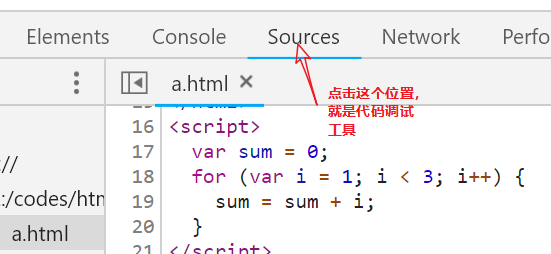


第二步：在左边找到代码所在文件，双击打开

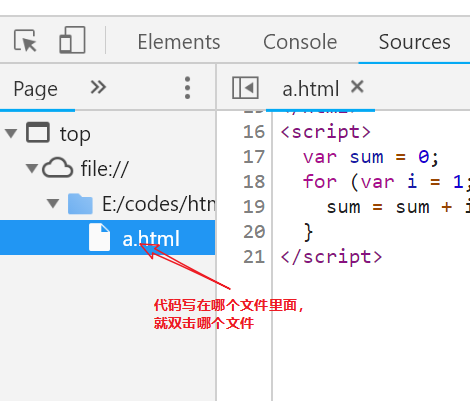

第三步：在中间部分找到自己写的代码，在想要暂停的地方打上断点

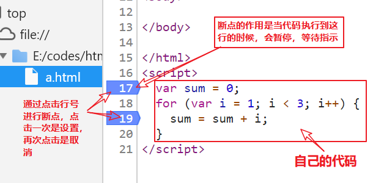

第四步：触发代码的执行，现在我们的代码是在浏览器打开的时候执行，所以我们只要刷新页面即可。

当代码执行到断点所在行，会暂停

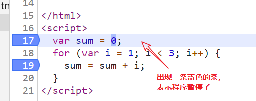

第五步：通过点击右边的控制执行按钮，可以让代码按照你的意愿执行


课堂补充监视


> 回顾
>
> 1.调试代码是一个程序员最基本的也是最重要的能力之一，没有人能保证自己写的代码没有bug，有了bug可能通过观察代码看出，但是更多的是观察看不出的，就要通过调试代码找出来。
>
> 2.浏览器里面调试代码，断点是一个重要的功能，有了断点后，我们可以逐步执行代码，通过观察当前的变量等方式，找到bug所在


# 数组

## 教学目标
- [ ] 能理解数组的作用
- [ ] 能使用[]定义数组
- [ ] 能使用索引为数组存储数据
- [ ] 能使用索引将数据从数组中取出
- [ ] 能使用for循环遍历数组

一个数据，我们使用一个变量存储就行，但是有时候我们的数据会有多个，如果还用一个变量存储一个数据，代码会变量得非常冗余。比如：一个人的成绩可以用一个变量存储，5个人的成绩，我们就不用5个变量存储了，我们可以使用数组存储。

## 什么是数组

数组是一个有顺序、有长度的数据集合

## 定义数组

```javascript
// 5个人的成绩为： 91，88，72，45，63
// 先定义一个数组
var arr = [];
console.log(arr); // 输出 []  这是一个没有数据在里面的数组，称为空数组
```

## 数组存值

数组中的数据使用索引管理。索引就是序号，只不过数组中的数据从0开始

```javascript
//把成绩存储到数组中
arr[0] = 91;
arr[1] = 88;
arr[2] = 72;
arr[3] = 45;
arr[4] = 63;
console.log(arr); // 输出 [91,88,72,45,63] 就是一个数据集合
```

但是这个方式是比较麻烦的，我们如果一开始就知道数组了，可以直接使用一个简单的语法存储数据

```javascript
var arr = [91,88,72,45,63];
console.log(arr); // 输出的结果是一样的
```

> tips : 两个方式自己可以灵活使用


## 数组取值

把数据存储在数组里面，是为了将来能使用的，所以要从里面把数据取出来。数据取值同样使用索引取。

```javascript
console.log(arr[0]);
var sum = arr[0] + arr[1] + arr[2] + arr[3] + arr[4];
console.log(sum); // 输出370
```

> 把 `数组[索引]`格式当成一个变量使用就行

## 遍历数组

我们在求成绩总和的时候，一个一个地把数组里面的数组取出来了，从索引 0 到最后一个索引，里面有很多重复的代码，我们其实可以使用循环实现。

```javascript
// 最初的写法
var sum = arr[0] + arr[1] + arr[2] + arr[3] + arr[4];
```

转化一下

```javascript
var sum = 0;
sum += arr[0];
sum += arr[1];
sum += arr[2];
sum += arr[3];
sum += arr[4];
```

再转化

```javascript
var sum = 0;
var i = 0;
sum += arr[i];
i++;
sum += [i];
i++;
// 直到i == 4 结束
```

写成循环

```javascript
var sum = 0;
for(var i = 0; i <= 4; i++){
  sum += arr[i];
}
console.log(sum); // 输出 370，和我们一个一个相加是一样的
```

使用循环来遍历数组，当数组中的数据比较多的时候，会比较方便。

## 数组长度

我们在遍历数组的时候，发现总是从索引 0 开始遍历，到最后一个索引，但是如果数据比较多的时候，我们就不容易得到最后一个索引是多少。所以在这还有一个更简单的写法：使用数组的长度来控制遍历的次数。

数组长度：就是数组中数据的个数

```javascript
console.log(arr.length); // 数组.length 就是数组的长度
```

如果数组的长度是5，索引的最后一个就是4，我们发现最大索引总是比长度少 1 ，所以遍历还可以这么写

```javascript
for(var i = 0; i <= arr.lensgth - 1; i++){
  console.log(arr[i]);
}
// 简化一下
// 把 <= 的 = 号 去掉，会使循环的次数少一次，我们把上限次数+1，就变成了  i < arr.length - 1 + 1 ,最终：
for(var i = 0; i < arr.lensgth; i++){
  console.log(arr[i]);
}
```

### 练习

1. 求一个数组中所有数字的总和和平均值

2. 求数组中所有数字的最大值
3. 求数组中最大值的索引

## 补充：数组的构造函数

数组在js中还可以使用另一种方式创建，这个方式我们称为 ： 构造函数

```javascript
// 使用 构造函数 创建数组
var arr = new Array();
// 存储数据
arr[0] = 10;
arr[1] = 20;
console.log(arr);
```

也可以在创建的同时存储数据

```javascript
var arr = new Array(10,20);
console.log(arr);
```

但是要注意，如果只有一个数据，不要使用这个方式存储数据

```javascript
var arr = new Array(10);
console.log(arr); // 输出 [empty × 10]
```

这是因为，如果只给一个数字构造函数，它会认为你想要设置数组的长度，而不是要把数据存储在数组中。所以不能使用这个方式存储一个数字数据。如果非要存一个数据，使用别的方式存储。


> 回顾
>
> 1.如果要存储多个数据，就使用数组来存储
>
> 2.在数组里面使用索引访问每个数据
>
> 3.基于数组的顺序和长度，我们可以使用for循环遍历数组


# 使用git管理代码

> 不是大纲任务，而是从很早开始带学生使用这个工具

## 什么是git

git是一个代码版本管理工具软件，我们在将来的工具中，会经常使用，所以从现在开始，我们要习惯使用这个工具。

这个工具的作用主要是进行代码的版本管理。在团队开发中，如果多个人同时开发一个项目，就需要把代码管理起来，一来方便协同开发，二来当代码出现问题的时候，还可以回滚代码。

目标我们要学习的是，如何使用git进行代码版本管理，如何查看版本历史。

## 下载安装git

在浏览器中打开下载页面 

[git下载页面](https://www.git-scm.com/download/)

根据自己的操作系统选择对应的下载


下载完成就会得到一个安装文件


直接双击安装，无脑下一步安装即可。

第一次安装git需要我们先配置一下个人的信息。在任务位置右键，选择 `Git Bash Here`


就会出现一个可以输入的窗口


在里面分别输入下面的代码

```javascript
git config --global user.email "你自己的邮箱"
```

然后回车，之后再输入下面的代码

```javascript
git config --global user.name "你自己的名字"
```

再回车，我们的信息就设置好了。可以通过输入下面的代码进行查看

```javascript
git config --list
```


## 在vscode中使用git

在vscode中，我们可以找到这个图标，点击这个图标，就可以进行源代码管理

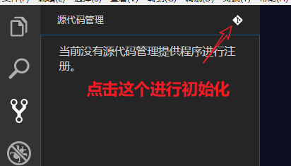

之后当你的代码发生变化，都会在里面有提示

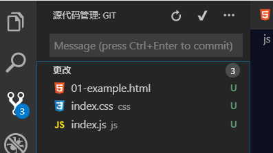

此时如果我们想保存一下操作历史

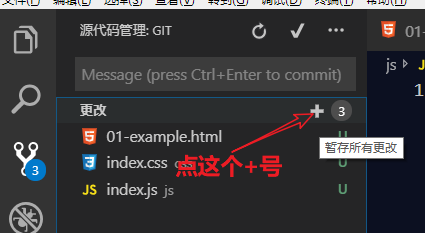

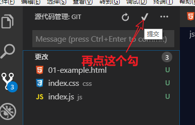


我们的操作历史就保存好了

## 使用gitLens插件查看操作历史

在vscode的插件库中找到gitLens插件

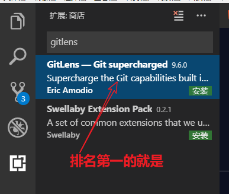

安装后在左边会出现这个插件的按钮


点击后，在窗口中就可以看到操作历史

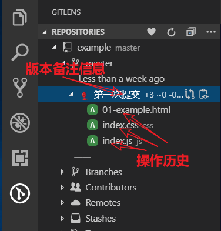

点开想要查看的文件


> 回顾
>
> 1.git是一个在开发中非常常用的版本管理工具，大家从现在开始要习惯使用它，将来工作的时候如果用不熟，就不是一个合格的程序员
>
> 2.在上课的过程中，我们也可以使用这个工具实现版本的管理。方便大家学习的时候，查看上课的思路

# 小项目：传智小娜v1.0

## 教学目标
- [ ] 能实现小娜的求和功能
- [ ] 能实现小娜的求日期功能
- [ ] 能实现小娜的讲笑话功能

## String

在小娜的功能1中，我们要从一个"数字,数字,数字"的格式中获取这些数字，就要把字符串以逗号为分隔符，分割这个字符串

js中提供了一个分割字符串的方法

字符串.split(指定分隔符)

```javascript
var str = '12,88,72,6';
// 以逗号为分隔符，分割字符串，得到一个数组
var arr = str.split(',');
console.log(arr); // 输出 ['12','88','72','6']
```

这个方法分割字符串后，会以一个数组的方式把所有的数字给我们


## Date

在小娜的功能2中，需要获取当前的日期和时间。

在js中，要获取系统的当前日期和时间，需要用到一个js自带的Date对象(现在先不管什么是对象，先学习如何使用)

### 创建Date对象

```javascript
var date = new Date();
console.log(data); // 系统时间不同，输出的结果也会不同，但是都是输出当前系统的时间
```

### 获取时间的各个部分

```javascript
var date = new Date();
// 获取年份
var year = date.getFullYear();
console.log(year);
// 获取月份 ， 得到的月份是从0开始的 ，使用 0-11 表示 1-12 月
var month = date.getMonth();
console.log(month);
// 获取天
var day = date.getDate();
console.log(day);
// 获取小时
var hour = date.getHours();
console.log(hour);
// 获取分钟
var minute = date.getMinutes();
console.log(minute);
// 获取秒数
var second = date.getSeconds();
console.log(second);
```


## Math

在js中也提供了获取随机数和取整的功能

### 获取随机数

```javascript
// 获取随机数
var r = Math.random();
console.log(r); // 输出一个在 [0,1) 之间的浮点数，可以得到0，但是无法得到1
```

如果想要得到一个随机整数，需要把整机浮点数  乘以 一个 倍数 再取整

```javascript
// 获取 [0,10) 之间的随机浮点数
var r = Math.random() * 10;
```

### 对浮点数取整

在js中，可以使用  Math.floor() 这个方法对浮点数取整，这个方法取整的方式是向下取整

**向下取整**： 将一个浮点数，向数轴的左边获取最近的一个整数

```javascript
// 向下取整
var a = Math.floor(1.12);
console.log(a); // 输出1
var b = Math.floor(1.99);
console.log(b); // 输出1
var c = Math.floor(-3.2);
console.log(c); // 输出 -4
var d = Math.floor(3.9);
console.log(d); // 输出 -4
```


### 获取一个随机整数

```javascript
// 获取一个 [0,10] 之间的随机整数
var r = Math.random();
r = r * (10 + 1) ;// 因为 Math.random得到的是不能得到1的浮点数，我们等下要向下取整，就得不到10了， * 11 向下取整才能得到10
r = Math.floor(r);
console.log(r); // 得到一个在 [0,10] 之间的整数
```


> 回顾
>
> 1.JavaScript中内置了很多的功能，使用这些功能，我们可以快速实现很多效果，这些内置的功能，我们称为内置对象
>
> 2.Date用于获取和日期相关的数据，Math用于实现和计算相关的功能，String用于快速实现和字符串相关的功能

# 函数

## 教学目标
- [ ] 能理解函数的作用
- [ ] 能使用function定义函数
- [ ] 能调用函数
- [ ] 能理解函数参数的作用
- [ ] 能使用return修改函数的返回值
- [ ] 能理解预解析和作用域

假设我们要输出一个故事

```javascript
console.log("从前有座山，山里有座庙");
console.log("庙里有个在给小和尚讲故事");
console.log("讲的是什么呢？");
console.log("老和尚对小和尚说：");
```

这是一个不断重复的故事，如果要重复多次，代码就会很多

```javascript
// 1次
console.log("从前有座山，山里有座庙");
console.log("庙里有个在给小和尚讲故事");
console.log("讲的是什么呢？");
console.log("老和尚对小和尚说：");
// 2次
console.log("从前有座山，山里有座庙");
console.log("庙里有个在给小和尚讲故事");
console.log("讲的是什么呢？");
console.log("老和尚对小和尚说：");
// ......
```

我们如果想重复使用一段代码，可以使用 `函数`解决这个问题

## 什么是函数

函数就是一段可以重复执行的代码段。

我们把一段相对独立的具有特定功能的代码块封装起来，形成一个独立实体，起个名字（函数名），在后续开发中可以反复调用。

函数的作用就是封装一段代码，将来可以重复使用。

## 函数的定义

语法：

```javascript
function 函数名(){
  函数体
}
```

如：

```javascript
function tellStroy(){
  console.log("从前有座山，山里有座庙");
  console.log("庙里有个在给小和尚讲故事");
  console.log("讲的是什么呢？");
  console.log("老和尚对小和尚说：");
}
```

## 函数的调用

然而我们写出上面函数的代码之后，在浏览器中打开页面，却没有任务内容被输出。这是因为函数在定义的时候，里面的代码是不会执行的，只有调用了函数，函数中的代码才会执行。

调用函数的语法

```javascript
函数名();
```

如：

```javascript
tellStroy(); //此时在控制台中就会输出一个故事
```

如果想输出多次，就可以调用多次这个函数

```javascript
tellStroy(); 
tellStroy(); 
tellStroy(); 
```

每调用一次，就会执行一次，做了代码的重复使用。

> tips : 一定要记住，函数定义时是不会执行的，只有调用时才会执行。可以使用代码调试工具进行代码执行过程观察。

## 函数的参数

我们希望在调用函数的时候，可以知道小和尚的名字是什么，而且每次可以给不同的小和尚讲故事。也就是说我们重复使用的过程里面有会变化的东西，我们使用`参数`解决

语法

```javascript
function 函数名(参数){
  函数体
}
```

如：

```javascript
function tellStroy(name){
  console.log("从前有座山，山里有座庙");
  console.log("庙里有个老和尚在给小和尚讲故事");
  console.log("讲的是什么呢？");
  console.log("老和尚对"+ name +"说：");
}
```

就是说参数就好像函数里面的一个变量一样，可以存储一个随时变量的数据

当我们调用函数的时候，再给一个真实的值

```javascript
tellStroy('清风');
tellStroy('明月');
```

如果我们想在调用函数的时候，把老和尚的名字也明确一下，也是可以的

```javascript
function tellStroy(name1,name2){
  console.log("从前有座山，山里有座庙");
  console.log("庙里有个老和尚在给小和尚讲故事");
  console.log("讲的是什么呢？");
  console.log(name1 "对"+ name2 +"说：");
}
```

要调用的时候：

```javascript
tellStroy('圆通','清风');
```

> tips: 函数的参数可以一个，也可以是多个，只要在重复的过程中，有多个会产生变化的数据，都可以使用参数的方式解决
>
> 在定义函数时写的占位用的参数，我们称为**形参**，在调用函数，实际参与函数执行的参数，我们称为**实参**

## 函数的返回值

需求： 使用函数的方式求两个数字的和

先观察两个数字相加的过程

```javascript
var a = 10;
var b = 20;
var sum = a + b;
```

这个过程中，a和b是两个可以产生变化的数据，我们把它们作为两个参数

```javascript
function getSum(a,b){
  var sum = a + b;
  console.log(sum);
}
```

这样就可以求任意两个数字的和了。但是我们说是求两个数字的和，不是输出这个和，想得到这个和，该怎么呢？

**函数的返回值**可以解决这个问题

什么是函数的返回值

函数执行完毕，会得到一个结果，这个结果就是函数的返回值

```javascript
var result = getSUm(20,30);
console.log(result);// 输出undefined
```

默认情况下，函数的返回值是undefined，如果想改变这个返回值，需要使用`return`关键字

`return`关键字的作用就是修改函数的返回值

```javascript
function getSum(a,b){
  var sum = a + b;
  return sum;
}
```

我们再执行这个函数

```javascript
var result = getSUm(20,30);
console.log(result);// 输出50 , return 修改了函数的返回值
```

### 补充：

return关键字的作用不仅仅是修改了函数的返回值，还能终止函数的执行

```javascript
function fn(){
  console.log(1);
  console.log(2);
  return;
  console.log(3);
  console.log(4);
}
fn(); // 只输出了1和2，3和4没有执行，return 终止了函数的执行，即： return 后面的代码不会执行
```

## 练习

1. 求1-n之间所有数的和
2. 求n-m之间所有数的和
3. 圆的面积(圆的面积公式： 圆周率 * 半径的平方 
4. 求三个数的和

### 书写函数的步骤

1. 写出要实现的过程
2. 分析过程中哪些是会变化的，哪些是不会变化的
3. 把变化的作为参数，不变的作为函数体
4. 按照函数的语法把代码写来
5. 考虑是否需要修改函数的返回值

## arguments

我们求三个数的和可以调用求两个数的和的函数，那么要求四个数的和也调用求三个数的和的函数，这样如果要求n个数的和，就要写n-1个函数了，这样是很麻烦的

在js中，函数的实参和形参的个数是允许不同的

```javascript
function fn(a,b){
  return a + b;
}
fn(1,2,3,4);// 正常执行，不会报错
```

但是我们如果得到在实参里多出的3和4呢？js里面提供了一个在函数中专用的，获取所有实参的对象：arguments

```javascript
function fn(){
  console.log(arguments);
}
fn(1); // 输出 [1]
fn(1,2) // 输出 [1,2]
fn(1,2,3,4,5) // 输出 [1,2,3,4,5]
```

arguments 这个东西看起来像数组，但是其实不是一个数组，我们管它叫 `伪数组`。它具有数组的长度和顺序等特征。

> 注意： arguments这个东西只能在函数内部使用，也不需要我们声明，只要我们在函数中直接使用就行

arguments这个东西就解决了我们要求n个数字的和的问题

```javascript
function getSum(){
  var sum = 0;
  for(var i = 0; i < arguments.length ; i++){
    sum += arguments[i];
  }
  return sum;
}

getSum(1,2,3);// 输出 6
getSum(1,2,3,4,5); // 输出15
```


## 补充

### 函数表达式

js中声明函数的方式不只有一种，还有一各叫`函数表达式`

语法：

```javascript
var 函数名 = function(参数){
 	函数体
}
```

如：

```javascript
var getSum = function(a,b){
  return a + b;
}
getSum(10,20);
```

### 函数的形参和实参互不影响

```javascript
var a = 10;
var b = 20;

function fn(x,y){
  x = x + y;
  console.log(x,y);
}

fnm(a,b); // 输出 30，20
console.log(a,b); // 输出 10,20 a的值并没有受到x的变化影响
```

### 匿名函数

匿名函数就是没有名字的函数

```javascript
function (参数){
  函数体
}
```

但是在js的语法中，是不允许匿名函数单独存在的，要配合其它语法使用：

如：

```javascript
var fn = function(a,b){
  return a + b;
}
```

### 自调用函数

一种会自动调用的函数

```javascript
(function(){
  函数体
})();
```

如：

```javascript
(function(){  
  console.log(10);  
})();
// 定义之后，立刻调用，输出10
```

> 这个语法暂时用不到，了解即可


### 函数也是一种数据类型

```javascript
function fn(){}
console.log(typeof fn); // 输出 字符串的  function
```

在js中，只要归数据类型管的，都可以作为函数的参数

```javascript
function f1(a,b){
  return a + b;
}
f1(10,20); // 数字作为参数
f1('abc','def') // 字符串作为参数
```

函数也是数据类型，也可以作为别的函数的参数

```javascript
function f1(a,fn){
  console.log(a);
  fn();//函数的调用，在函数名的后面加括号
}
function f2(){
  console.log('f2函数执行了');
}
f1(10,f2);// 输出 10 和 'f2函数执行了'
```

像这种作为函数的参数，并在之内调用的函数，我们称为 `回调函数`

>  **回调函数**   以参数的形式，传入另一个函数，并在其内被调用的函数


### 作用域

```javascript
var a = 10;
function f1(){
  console.log(a);
}
f1();// 变量a在函数外定义，可以在函数内使用

function f2(){
  var b = 20;
}
console.log(b); // 变量b在函数内定义，在函数外无法访问，报错： b is not defined
```

这是因为js中存在作用域的概念。

作用域：

作用域就是指定一个变量或者一个函数的作用范围。

能在页面的任何位置都可以访问，称为 **全局作用域**

只能在函数内访问，称为为  **局部作用域**

在全局作用哉下声明的变量，称为 **全局变量**

在局部作用域下声明的变量，称为 **局部变量**

上述代码中，a是全局变量，b是局部变量

### 作用域链

在JavaScript里面，函数内部是可以包含另一个函数的

```javascript
function a(){  
  function b(){
    
  }  
}
```

此时函数b就被函数a包含越来了，这样就形成了两层作用域。


如果有以下代码

```js
var x = 10;
console.log(x);
function a(){
  var x = 20;
  console.log(x);
  function b(){
    var x = 30;
    console.log(x);
  }
  b();
}
a();
```

会依次输出：10，20，30

虽然多个变量x同名，但是不同作用域内优先使用自己内部作用域的变量x。

如果代码做一下修改

```js
var x = 10;
console.log(x);
function a(){
  var x = 20;
  console.log(x);
  function b(){
    // 函数b内部没有x变量了
    console.log(x);
  }
  b();
}
a();
```

依次输出10,20,20

函数b内部没有变量b，会向自己的外面的作用域查找x变量，函数a内的x变量离函数b最近，会优先得到函数a的变量x

代码再做修改

```js
var x = 10;
console.log(x);
function a(){
  // 函数a内部的变量x也没有了
  console.log(x);
  function b(){
    // 函数b内部没有x变量了
    console.log(x);
  }
  b();
}
a();
```

会依次输出10,10,10

函数b内部没有x变量，会向函数a的作用域查找，但是函数a内部也没有x变量，会向函数a的上一层作用域再查找，直到查找到了全局作用域。

代码再次变化

```js
// 全局的变量x也没有了
function a(){
  // 函数a内部的变量x也没有了 
  function b(){
    // 函数b内部没有x变量了
    console.log(x);
  }
  b();
}
a();
```

函数b内部没有变量x，会顺着上层作用域一层一层地查找，直到全局作用域也没有，就会报错。

> 总得来说：
>
> 如果程序中存在多级作用域，就形成了一个作用域链(作用域的一层一层关系)
>
> 其上有变量的访问规则
>
> 1.如果内部有这个变量，优先使用这个自己内部的变量
>
> 2.如果自己内部没有这个变量，则会上层作用域查找，从最近的作用域中获取变量
>
> 3.如果查找到了全局作用域也没有这个变量，则报错

**作用域链：变量的查找规则**

### 预解析

```javascript
fn();// 正常执行
function f1(){
  console.log(1);
}
fn(); // 正常执行

f2();// 报错 ： f2 is not a function
var f2 = function(){
  console.log(2);
}
// function 关键字定义的函数，可以在定义之前使用，函数表达式的不行
```

因为在js中，代码执行之前，会先进行一次**预解析**

预解析就是在执行代码之前，把代码中的变量声明和函数声明，提升到当前作用域的最顶端，而变量的赋值和函数的调用还在原来的位置。

上面的代码预解析后：

```javascript
function f1(){
  console.log(1);
}
var f2;
fn();
fn(); 
f2();
f2 = function(){
  console.log(2);
}
```

所以在调用f1的时候，其实函数已经声明好了，但是在调用f2的时候，f2还是undefined，就会报错

### 练习

```javascript
// 观察下面的代码，说出执行结果
var num = 10;
fun();
function fun() {
  console.log(num);
  var num = 20;
}
```


> 回顾
>
> 1.函数在JavaScript中是一种非常重要的角色
>
> 2.当我们需要把代码重复使用的时候，可以使用函数把要重复使用的代码包起来
>
> 3.封装函数就是找到过程中会变化的作为参数，把不变的作为函数体
>
> 4.封装好的代码只会在调用函数的时候执行
>
> 5.函数可以形成一个作用域，里面的数据在外面是不能访问的
>
> 6.函数的变量会在预解析的时候提升


# 小娜v2.0 

## 教学目标
- [ ] 能将日期中补全0的判断封装成函数
- [ ] 能将获取日期的代码封装成函数
- [ ] 能将计算总和的代码封装成函数

使用函数对v1.0中的代码进行封装，达到重用的效果

## 计算总和的封装

```javascript
function calculateCount(nums) {
  var sps = nums.split(',');
  var sum = 0;
  for (var i = 0; i < sps.length; i++) {
    sum += parseFloat(sps[i]);
  }
  return sum;
}
```

## 日期时间数字补足两位的封装

```javascript
function patchFrontZero(num) {
  if (num < 10) {
    num = "0" + num;
  }
  return num;
}
```

## 格式化日期的封装

```javascript
function getFormateDate() {
  var date = new Date();
  var year = date.getFullYear();
  var month = date.getMonth() + 1;
  month = patchFrontZero(month);
  var day = date.getDate();
  day = patchFrontZero(day);
  var hour = date.getHours();
  hour = patchFrontZero(hour);
  var minutes = date.getMinutes();
  minutes = patchFrontZero(minutes);
  var seconds = date.getSeconds();
  seconds = patchFrontZero(seconds);
  var format = year + "-" + month + "-" + day + " " + hour + ":" + minutes + ":" + seconds;
  return format;
}
```


> 回顾：
>
> 1.项目的目的就是让大家能使用函数封装代码，能让逻辑的代码里面更简洁

# 对象

## 教学目标
- [ ] 能说出什么是对象
- [ ] 能创建一个对象
- [ ] 能为对象添加属性和方法
- [ ] 能遍历对象


## 什么是对象

在编程中，`万物皆对象`。我们在编程中，使用对象来描述万事万物。怎么描述呢？什么事物，只要描述了其特征和行为就可以知道在描述什么。

举个例子，我们猜个谜语：

什么东西，小时候是黑色的，长大是绿色的，小时候在水里游，长大了在岸上跳。

基本都可以猜到，我们描述的是青蛙。

其中，颜色是青蛙的特征，在水里游和在岸上跳是行为。

我们在编程中，也是使用`特征`和`行为`描述任何事物。

使用`属性`描述事物的`特征`，使用`方法`来描述`行为`， 就是对象这种语法。

所以：对象就是属性和方法的集合

## 对象有什么用

我们之前学习过的对象：Math、Date

我们发现，只要学习对象的一些属性和方法，直接使用，就可以得到自己想要的效果。

例如-得到随机数： Math.random() 

我们不需要关心随机数到底是怎么产生的，只要结果——不关心过程，只关心结果

1. 使用对象可以方便的记录一些数据

这就要涉及到一个在编程界内的著名思想——面向对象思想

什么是面向对象思想？找对象，命令对象做事情。

肚子饿了，想吃饭，找一个厨师，命令厨师做饭给我们吃。厨师就是一个对象。我们不关系厨师是如果做饭的，只要做好了给我们吃就行。

就好像我们获取当前日期：

```javascript
// 新找到一个日期对象，就好像我们找到一个厨师
var date = new Date();
// 调用日期对象的获取年份的方法，就好像我们命令厨师做饭
date.getFullYear();
```

所以对象的好处在于：我们只要知道对象有什么属性和方法，不需要知道对象里面是如何实现的。我们实现一个效果的过程将大缩短，实现高效开发。

## 对象的语法

### 创建对象

#### 构造函数

```javascript
var obj = new Object(); // 这是一个没有属性和方法的对象
console.log(obj);
```

#### 字面量

```javascript
var obj = {}; // 这也是一个没有属性和方法对象，其本质和构造函数创建的对象是一样的
console.log(obj);
```

### 为对象添加属性和方法

添加属性的语法：

对象.属性 = 值;

添加方法的语法:

对象.方法名 = function(){}

如： 使用对象描述一个叫`狗蛋`的人

```javascript
var obj = {};
obj.name = '狗蛋';// 名字是一个人的特征
obj.sayName = function(){  // 人会说出自己的名字，也就是人有自己的行为
	console.log('你好，我叫' + obj.name);
}
```

### 使用对象的属性和方法

访问对象的属性：

对象.属性

调用对象的方法：

对象.方法名(参数);

```javascript
// 得到对象的名字,属性可以当成变量使用
console.log(obj.name);
// 调用对象的方法，方法的本质是函数
obj.sayName();
```

> 永远记住：只有对象才能点属性和方法

## 对象语法补充

### 字面量初始化对象

```javascript
// 描述一个学生
var student = {
  name : '狗蛋',
  age : 12,
  gender : '男',
  sayName : function(){
    console.log(student.name);
  }
}
// 属性和值之间使用分号分隔，一个属性和一个值叫一个键值对。多个键值之间使用逗号分隔
```

上面的方式是可以创建对象的，但是只能一个一个的创建，如果我们要创建大量的对象，那么上面的两个方式也就不推荐了。

当我们要大量创建的时候，我们想要创建对象，更好的方式是：**自定义构造函数**

### 自定义构造函数

语法格式

```javascript
function 要描述的对象的种类(参数){
  this.属性1 = 参数1;
  this.属性2 = 参数2;
  ...
  this.方法名 = function(){}
  ...
}
```

例如我们要给学生对象写构造函数

```javascript
// 我们习惯将 描述对象种类的名词首字母大写
function Student(name,age,gender){
  // 属性名不是一定要和形参一样，但是从语义的角度，最好是一样的
  this.name = name;
  this.age = age;
  this.gender = gender;
  // 学生有一个自我介绍的方法
  this.sayHi = function(){
    console.log('您好，我叫'+this.name+',今年'+this.age+'岁了，是个'+this.gender+'孩子');
  }
}
```

此时当我们要创建一个学生的时候，只要`new`操作一下

```javascript
var s1 = new Student('狗蛋',12,'男');
console.log(s1);
// 让一个学生对象做自我介绍
s1.sayHi();
```

> 被构造函数new出来的对象，我们称为该对象的实例对象——上面的代码来说，s1是Student构造函数的实现全对象

### this关键字

在上面的代码中，我们发现一个东西叫`this`，这是JavaScript说法中的一个关键字，这个关键字的作用是在函数中自动指代一个对象。

也就是说，**this是一个对象**

这个对象到底是谁呢？不用死记硬背，每次想看看this是谁的时候，只要输出一下

```javascript
function Student(name,age,gender){
  this.name = name;
  this.age = age;
  this.gender = gender;
  console.log(this);
}
```

`Student`是一个函数，我们需要调用才会执行，而它又是一个构造函数，所以我们调用它的方式是new

```javascript
var s1 = new Student('狗蛋',12,'男');
```

当函数执行的时候，输出

```js
{
  name : '狗蛋',
  age : 12,
  gender : '男'
}
```

也就是说函数里面的this是被new出来的实例对象

> 结论：构造函数里面的this是被new出来的实例对象


### new关键字

我们在使用构造函数创建对象的时候，还用到了一个`new`关键字

这个关键字的意思是`新建`，用法就是配合构造函数使用，构造函数在new的时候其实有这么一个过程。

1.调用构造函数

2.创建一个新的对象并用this指代这个对象

3.执行构造函数里面的代码，给this指代的对象添加属性和方法

4.返回this所指代的对象

> new 的过程还是比较复杂的，平时一般不关注，不需要记，知道即可


### 键的方式访问对象的属性和有方法

语法：

对象[属性名]

```javascript
var obj = {};
obj['name'] = '狗蛋';
obj['sayName'] = function(){
  console.log('你好，我叫' + obj['name']);
}
```

### 遍历对象

语法：

for(var key in obj){

}

key 就是obj这个对象中的每个键，obj就是要遍历的对象。

```javascript
var obj = {
  name : '狗蛋',
  age : 12,
  gender : '男'
};
for(var key in obj){
  console.log(key);
  console.log(obj[key]);
}
```


> 回顾
>
> 1.对象不仅仅是一种语法，更是一种思想，一种方便解决问题的思想
>
> 2.使用对象来表示一个可以帮我做事的东西，我们只要调用对象的方法和属性，就能实现效果
>
> 3.对象语法使用属性描述事物的特征，使用方法描述事物的行为

# 小娜v3.0

把小娜看成一个对象，把属性和访求封装好。直接调用

# 简单类型和复杂类型

## 教学目标
- [ ] 能理解简单类型和复杂类型在内存中存储方式的不同

简单类型和复杂类型的数据在内存中的存储是不一样的。我们先下面的代码

```javascript
var a = 10;
var b = a;
b = 20;
console.log(a,b);//输出 10，20 也就是说，a的值不会受到b的值的改变而影响
```

```javascript
var obj1 = {
  name : '狗蛋'
};
var obj2 = obj1;
obj2.name = '翠花';
console.log(obj1.name,obj2.name); // 输出 两个翠花 ， 也就是说，obj1的name属性受到了obj2的name属性影响
```

原因就是两个类型在内存中的存储不同

**简单类型数据存储在内存的栈空间中，复杂类型的数据存储在内存的堆空间中**

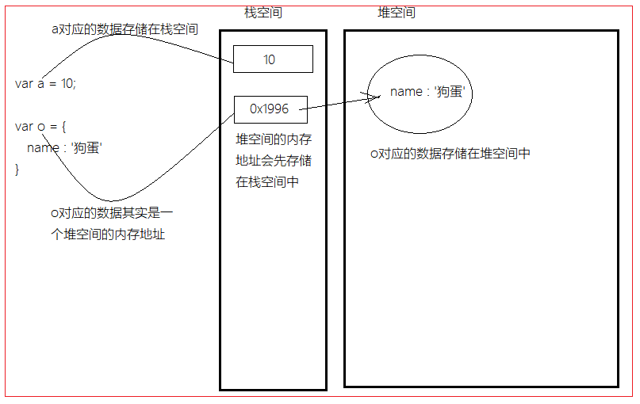

把一个变量赋值给另一个变量的时候，其实是把栈空间的数据复制了一份

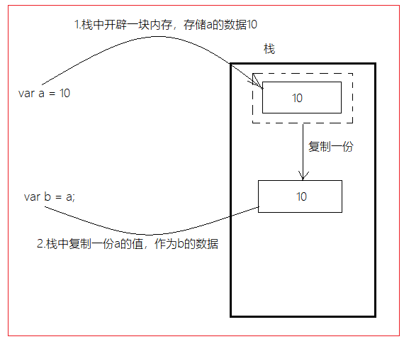

当另一个数据发生变化，会根据变量找到对应的数据，进行修改


此时，简单类型的的变量赋值给另一个变量，另一个变量改变了，不会影响原来的变量

但是在复杂类型的时候不一样

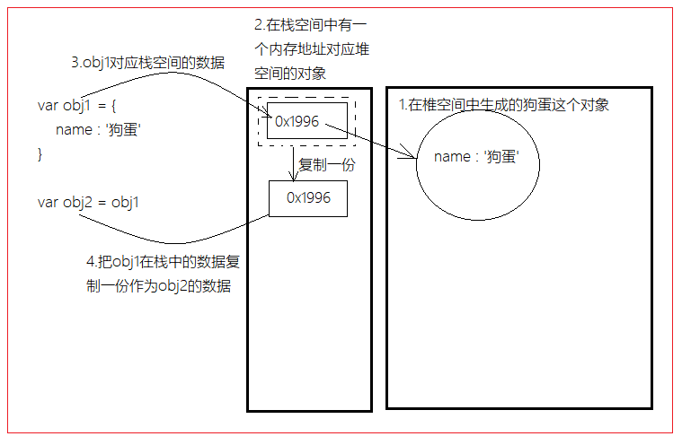

当另一个变量发生变化

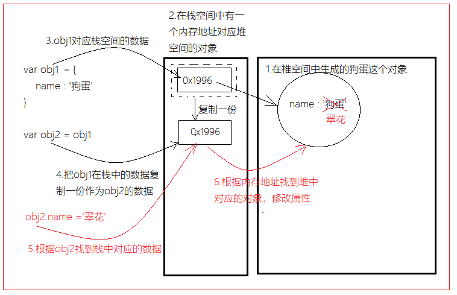

所以obj1和obj2修改的其实是同一个对象


有了上面的理解后，我们看看下面的代码

```js
var o1 = {
  name : '狗蛋'
}
var o2 = {
  name : '狗蛋'
}
console.log(o1 === o2);
```

猜猜最终会输出什么？答案是false。

观察下面的图解

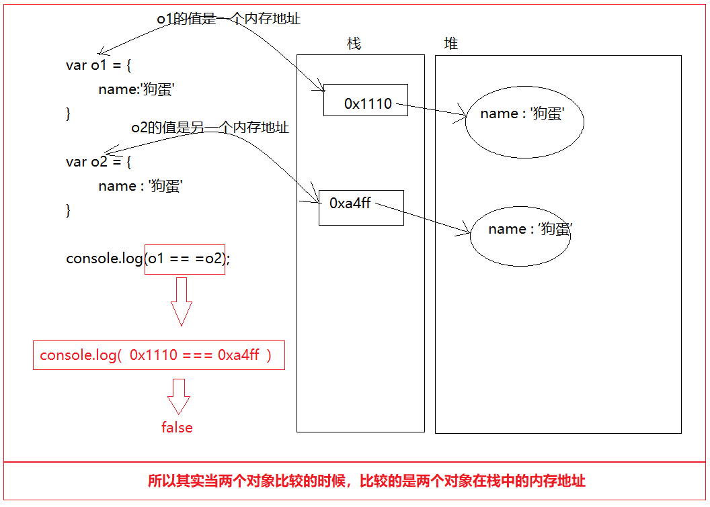

当执行`var o1 = { name : '狗蛋' }` 的时候，先在堆空间中生成一个对象，并在栈空间中存储一个内存地址,o1这个变量存储的是这个对象的内存地址。当执行`var o2 = { name : '狗蛋' }` 的时候，也在堆空间中生成另一个新的对象，并把该对象的内存地址存在栈空间中，o2变量中存储的是新对象的内存地址。

所以判断`o1 === o2` ，两个值分别是两个内存地址，所以判断的结果是`false`

> 结论：当两个复杂类型的变量在比较的时候，比较的是对象的内存地址


> 回顾
>
> 1.简单类型的复杂类型的区别在于两者存储的位置不同


# 内置对象

## 教学目标
- [ ] 能说出Math对象的3个方法和方法的作用
- [ ] 能说出Array对象的3个方法和方法的作用
- [ ] 能说出Date对象的3个方法和方法的作用
- [ ] 能说出String对象的3个方法和方法的作用

所谓内置对象，就是JavaScript自带的一些功能对象，里面提供了很多常用、实用的属性和方法，我们需要做的就是学习这些属性和方法怎么使用，在需要用的时候直接用就行

## Math对象

> Math.random()、Math.floor()、Math.ceil()必讲，其它选讲

Math.random(x)

这个方法的作用是生成一个 [0,1) 之间的随机浮点数

```javascript
var r = Math.random();
console.log(r);// 每次执行等到的数字都一样
```

Math.floor(x)

这个方法的作用是把一个浮点数进行向下取整

```javascript
console.log(Math.floor(3.1));  // 3
console.log(Math.floor(3.9));  // 3
console.log(Math.floor(-3.1)); // -4
console.log(Math.floor(-3.9)); // -4
```

向下取整就是从这个数字开始，朝数轴的左边找到一个离它最近的整数

Math.round(x)

这个方法的作用是把一个浮点数进行四舍五入取整

```javascript
console.log(Math.floor(3.1));  // 3
console.log(Math.floor(3.9));  // 4
console.log(Math.floor(-3.1)); // -3
console.log(Math.floor(-3.9)); // -4
```

Math.ceil(x)

这个方法的作用是把一个浮点数进行向上取整

```javascript
console.log(Math.floor(3.1));  // 4
console.log(Math.floor(3.9));  // 4
console.log(Math.floor(-3.1)); // -3
console.log(Math.floor(-3.9)); // -3
```

向上取整就是从这个数字开始，朝数轴的左边找到一个离它最近的整数

练习：

1. 求[0,10]之间的随机整数
2. 求[10,20]之间的随机整数

Math.abs(x)

这个方法的作用是求一个数的绝对值

```javascript
console.log(Math.abs(3));  // 3
console.log(Math.abs(-3)); // 3
```

Math.max(x,y...)

这个方法的作用是求多个数字中的最大值

```javascript
console.log(Math.max(10,20));  // 20
console.log(Math.max(8,4,5,7,3)); // 8
```

这个方法的参数个数是不限定的，想写几个就写几个

Math.min(x,y...);

这个方法的作用是求多个数字中的最小值

```javascript
console.log(Math.max(10,20));  // 10
console.log(Math.max(8,4,5,7,3)); // 3
```

这个方法的参数个数是不限定的，想写几个就写几个


## Date对象

> 创建指定日期和获取总毫秒数必讲，其它选讲

这是一个在js中用于操作日期时间的对象

创建一个Date对象

```javascript
var date = new Date(); // 得到的是当前时间的日期对象
```

```javascript
// 获取当前的年月日时分秒
var date = new Date();
console.log(date.getFullYear());// 年份
console.log(date.getMonth()); // 月份，从0开始
console.log(date.getDate()); // 当前天数
console.log(date.getHours()); // 小时，0-23
console.log(date.getMinutes()); // 分钟 ， 0-59
console.log(date.getSeconds()); // 秒数 ， 0-59
console.log(date.getMilliseconds()); // 毫秒 0-999 ， 1秒 = 1000毫秒
```

创建一个指定日期的对象

```javascript
// 给一个日期格式字符串
var date = new Date('2019-01-01');
// 分别传入年月日时分秒
var date = new Date(2019,0,1,12,33,12);
```

获取从1970年1月1日到现在的总毫秒数

```javascript
var date = new Date();
console.log(date.valueOf());

console.log(Date.now());
```

## Array对象

这个对象中提供了很多操作数组的方法

push/pop - 必讲

```javascript
// 数组的push方法用于将一个或多个元素从数组的尾部添加
var arr = [1,2,3];
arr.push(4,5,6);
console.log(arr);
```

```javascript
// 数组的pop方法用于将数组的最后一个元素移除
var arr = [1,2,3];
arr.pop();
console.log(arr);
```

unshift/shift

```javascript
// 数组的unshift方法可以将多个元素从数组的前面添加进数组
var arr = [1,2,3];
arr.unshift(4,5,6);
console.log(arr);
```

```javascript
// 数组的shift方法用于将数组的第一个元素移除
var arr = [1,2,3];
arr.shift();
console.log(arr);
```

join - 必讲

```javascript
// 数组的join方法用于将数组中的多元素以指定分隔符连接成一个字符串
var arr = ['刘备','关羽','张飞'];
var str = arr.join('|');
console.log(str);
```

indexOf - 必讲

```javascript
// 数组的indexOf方法的作用是根据元素查找索引，如果这个元素在数组中，返回索引，否则返回-1
var arr = [10,20,30]
console.log(arr.indexOf(30));
console.log(arr.indexOf(40));
```

concat  - 必讲

```javascript
// 数组的concat方法的作用是把多个数组合并成一个新的数组
var arr1 = [1,2,3];
var arr2 = [4,5,6];
var arr3 = [7,8,9];
var res = arr1.concat(arr2,arr3);
console.log(res);
```

filter  - 必讲

```javascript
// 数组的filter方法用于将数组中满足条件的元素筛选出来
// 筛选出数组中 小于 2000 的数据
var arr = [1500,1800,2200,300,2600,800];
var res = arr.filter(function(item,index){
  return item < 2000;
});
// fitler方法的的参数要求是一个函数，这个函数接收两个参数：item是数组中的每个元素，index是item对应的索引
```

forEach  - 必讲

```javascript
// 数组的forEach方法用于遍历数组
var arr = [10,20,30,40,50];
arr.forEach(function(item,index){
  console.log(item,index);
});
// forEach方法需要一个参数是一个函数，这个函数也接收两个参数，item是数组中的每个元素，index是item的索引
```

findIndex  - 必讲

```javascript
// 数组的findIndex方法用于查找满足条件的第一个元素的索引，如果没有，则返回-1
var arr = [10, 20, 30];
var res1 = arr.findIndex(function (item) {
  return item >= 20;
});
console.log(res1);
var res2 = arr.findIndex(function (item) {
  return item >= 50;
});
console.log(res2);
```

splice - 必讲

```javascript
// 数组的splice方法用于从数组的指定位置移除、添加、替换元素
var arr = ['a','b','c','d','e'];
// 把d这个元素移除
arr.splice(3,1); // 从索引3开始移除，总共移除1个元素
console.log(arr);
// 在c的后面添加7和8两个元素
arr.splice(3,0,7,8); // 从索引3开始添加，移除0个元素，把7，8加入
console.log(arr);
// 把b这个元素替换成0
arr.splice(1,1,0);// 从索引1开始替换，总共替换1个，用0替换
console.log(arr);
```

## String对象

这个对象中的方法用于操作字符串

concat

```javascript
// 这个方法用于连接多个字符串，其作用相当于 + 操作符
var res = "abc".concat('def','ghi');
console.log(res);
```

indexOf  - 必讲

```javascript
// 这个方法用于查找某个字符串是否包含于另一个字符串
var str = '我爱中华人民共和国';
console.log(str.indexOf('中华'));
```

lastIndexOf

用法和indexOf一样，只不过是从后面开始找

split  - 必讲

```javascript
// 这个方法用于将一个字符串以指定的符号分割成数组
var str = '刘备|关羽|张飞';
var arr = str.split('|');
console.log(arr);
```

substring  - 必讲

```javascript
// 这个方法用于获取字符串中的部分字符
var str = '我爱中华人民共和国';
var res = str.substring(2,4);// 从索引2开始，到索引4结束，得到之间的字符，不包含索引4的字符
console.log(res);
```

substr 

```javascript
// 这个方法用于获取字符串中的部分字符
var str = '我爱中华人民共和国';
var res = str.substr(2,2);// 人索引2开始，总共获取2个字符
```

slice 

```javascript
// 这个方法用于获取字符串中的部分字符
var str = '我爱中华人民共和国';
var res = str.slice(2,4);// 从索引2开始，到索引4结束，得到之间的字符，不包含索引4的字符
console.log(res);
```

charAt

```javascript
// 这个方法用于获取字符串中位于指定位置的字符
var str = '我爱中华人民共和国';
console.log(str.charAt(2));
```

charCodeAt

```javascript
// 这个方法用于获取字符串中位于指定位置的字符的ASCII码
var str = 'abcdef'
console.log(str.charCodeAt(0));
```


## 自学

JavaScript中内置对象的方法有很多，我们不可能在短时间内全学会，所以需要学会自学这些东西。也就是说我们要学会查文档。

### MDN

Mozilla 开发者网络（MDN）提供有关开放网络技术（Open Web）的信息，包括 HTML、CSS 和万维网及 HTML5 应用的 API。

- [MDN](https://developer.mozilla.org/zh-CN/)
- 通过查询MDN学习Math对象的random()方法的使用

### 如何学习一个方法？

1. 方法的功能
2. 参数的意义和**类型**
3. 返回值意义和**类型**
4. demo进行测试


> 回顾
>
> 1.JavaScript的内置对象提供的方法很多，没法全记，尽量记住常用的
>
> 2.方法很多，要学会通过文档学习新的方法


